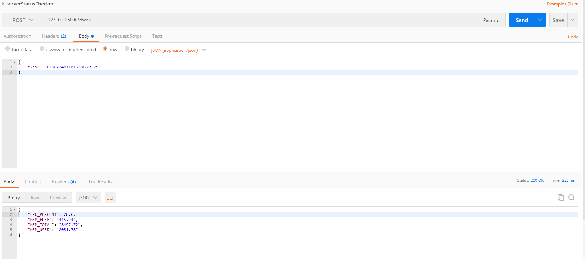
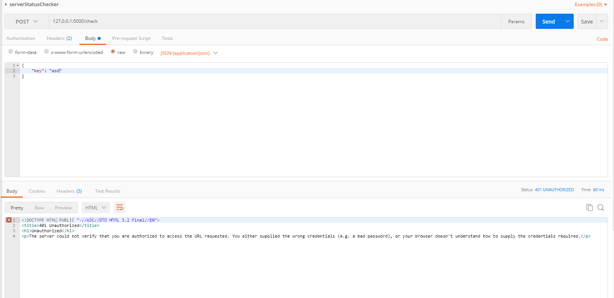

# 서버 상태를 웹을통해 확인하기 위한 python 프로젝트

# 프로젝트 사양
        python3
        pip install flask
        사용 포트 : 5000

# 프로그램 실행 및 설명
        1. 앱 실행 : python app.py
        2. 자동으로 키가 생성됨
        3. 키 확인 : cat ./.key
        4. 서버상태 확인 : 
                url : http://127.0.0.1:5000/check 
                method : POST
                params : {"key" : .key의 내용}
        5. 결과확인 :
                key가 틀릴 경우 : 401 에러 반환
                key가 맞을 경우 : 서버 상태를 json으로 반환.

# 반환 JSON
        {
            'CPU_PERCENT' : CPU 사용량 (%),
            'MEM_TOTAL': 총 메모리(MB),
            'MEM_USED': 메모리 사용량(MB),
            'MEM_FREE': FREE 메모리(MB),
        }

